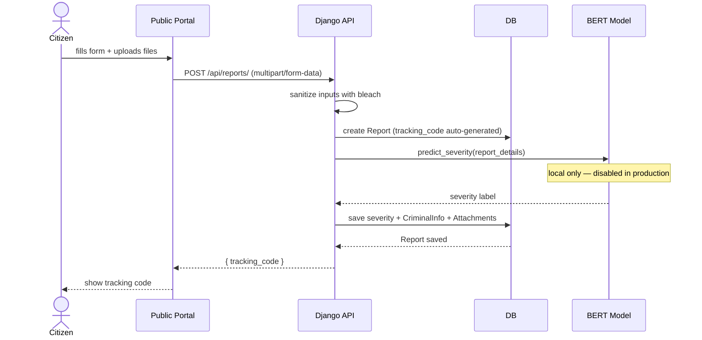
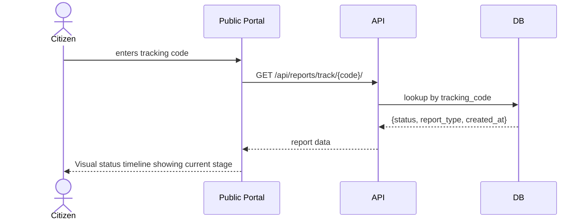
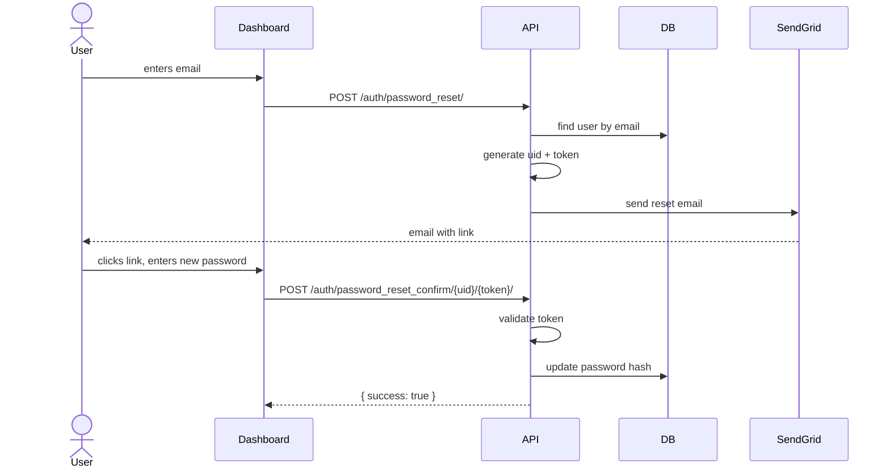

# Sequence Diagrams

---

## Submitting a report

```mermaid
sequenceDiagram
    actor Citizen
    participant Portal as Public Portal
    participant API as Django API
    participant DB
    participant AI as BERT Model

    Citizen->>Portal: fills form + uploads files
    Portal->>API: POST /api/reports/ (multipart/form-data)
    API->>API: sanitize inputs with bleach
    API->>DB: create Report (tracking_code auto-generated)
    API->>AI: predict_severity(report_details)
    Note over AI: local only — disabled in production
    AI-->>API: severity label
    API->>DB: save severity + CriminalInfo + Attachments
    DB-->>API: Report saved
    API-->>Portal: { tracking_code }
    Portal-->>Citizen: show tracking code
```

---

## Tracking a report

```mermaid
sequenceDiagram
    actor Citizen
    participant Portal as Public Portal
    participant API
    participant DB

    Citizen->>Portal: enters tracking code
    Portal->>API: GET /api/reports/track/{code}/
    API->>DB: lookup by tracking_code
    DB-->>API: {status, report_type, created_at}
    API-->>Portal: report data
    Portal-->>Citizen: Visual status timeline showing current stage
```

---

## Password reset

```mermaid
sequenceDiagram
    actor User
    participant Dashboard
    participant API
    participant DB
    participant SG as SendGrid

    User->>Dashboard: enters email
    Dashboard->>API: POST /auth/password_reset/
    API->>DB: find user by email
    API->>API: generate uid + token
    API->>SG: send reset email
    SG-->>User: email with link

    User->>Dashboard: clicks link, enters new password
    Dashboard->>API: POST /auth/password_reset_confirm/{uid}/{token}/
    API->>API: validate token
    API->>DB: update password hash
    API-->>Dashboard: { success: true }
```
